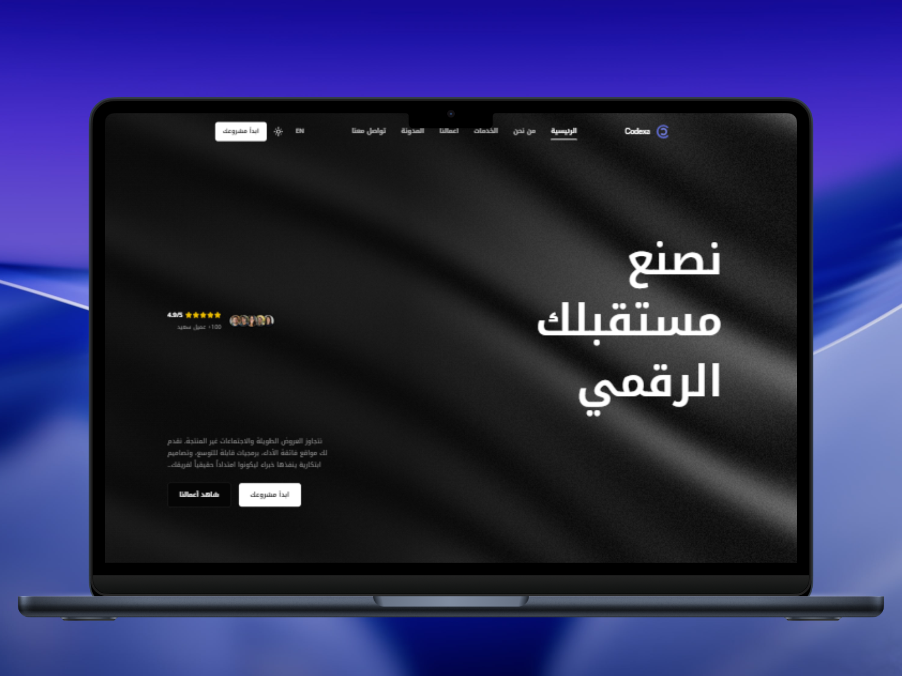
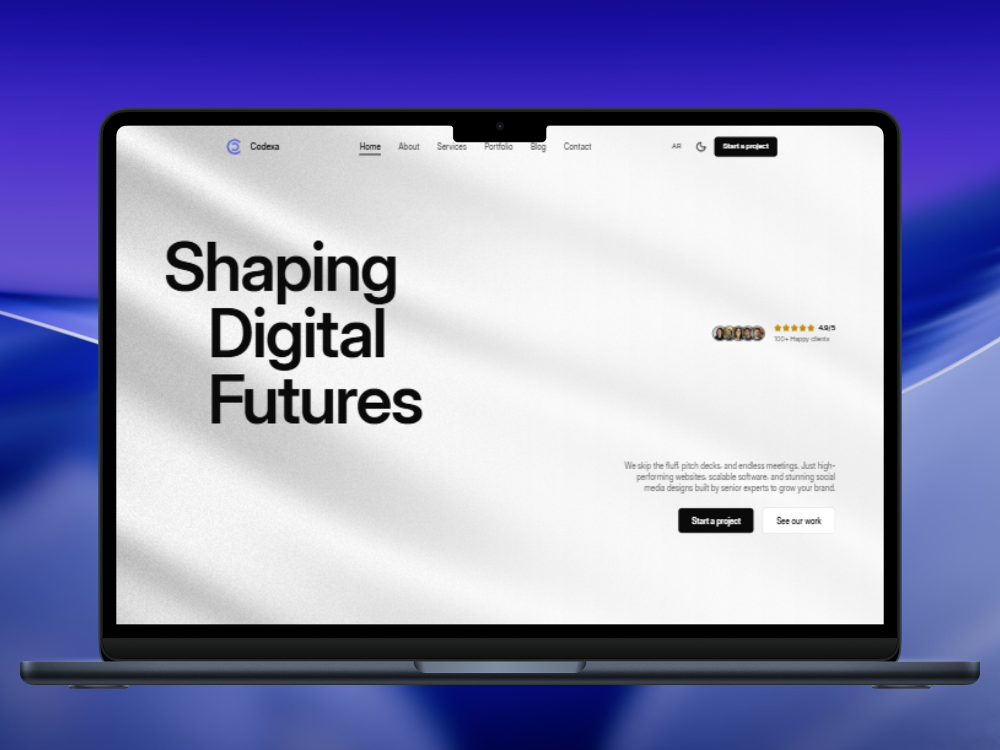
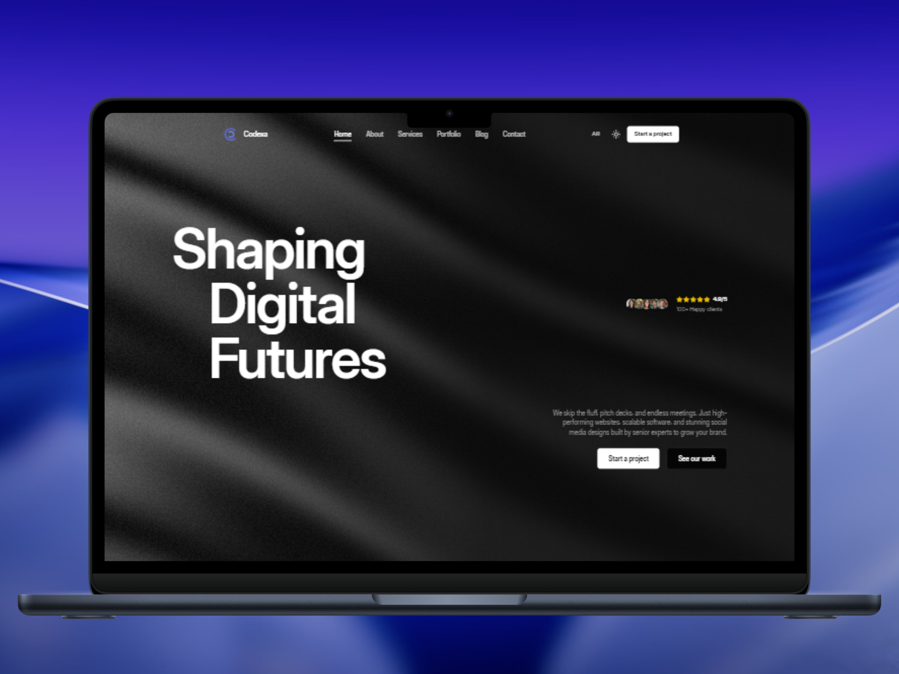
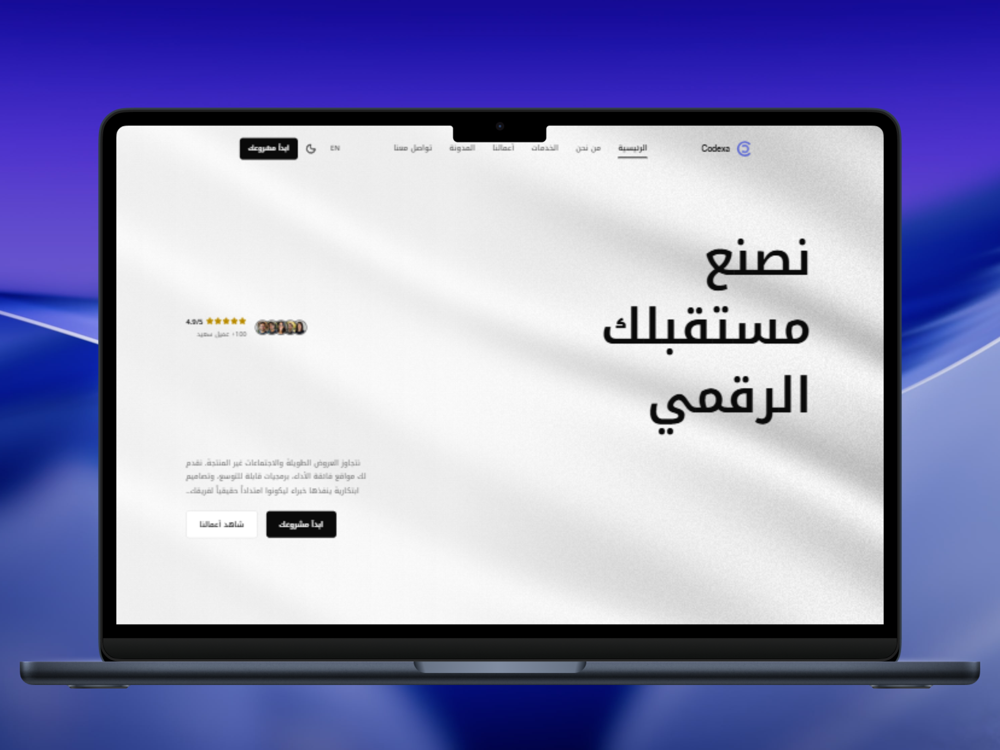
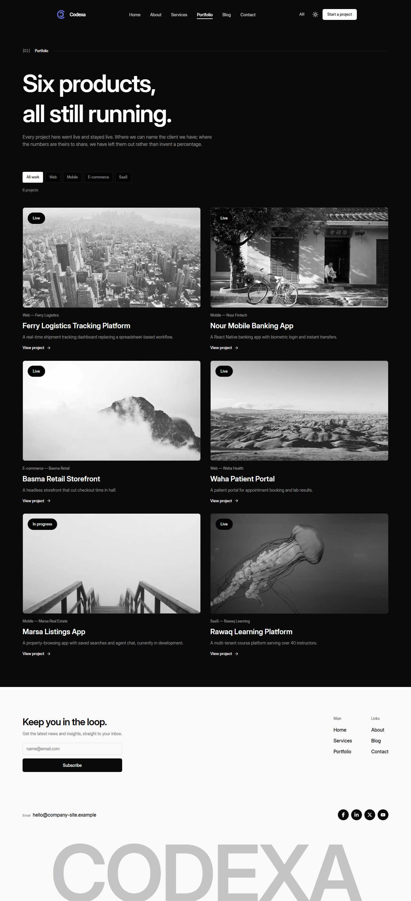
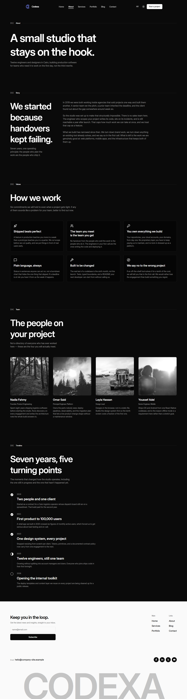
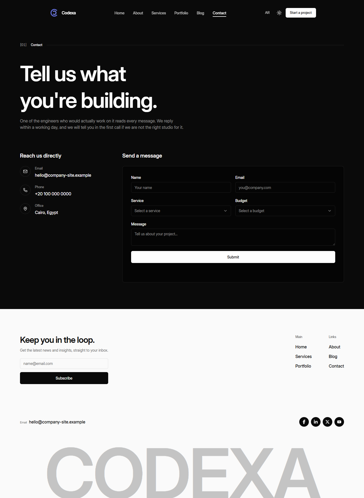

# Codexa

**A bilingual (AR/EN), dark-mode-first marketing site for a software agency — monochrome design system, RTL-native, and built to swap its content source without touching a single component.**

[](https://nextjs.org/)
[](https://www.typescriptlang.org/)
[](https://tailwindcss.com/)
[](https://next-intl.dev/)
[](https://motion.dev/)

**Live demo → [codexastudio.vercel.app](https://codexastudio.vercel.app/)**

<p align="center">
  
  
</p>

---

## Overview

Codexa is the public marketing site for a software agency, shipped in Arabic and
English from one codebase. Arabic is the default locale (`/` redirects to `/ar`),
and the layout uses logical CSS properties throughout, so direction flips
without a single `rtl:` override.

The visual identity is **monochrome** — white, black, and grey only. Elevation
is a 1px low-opacity border rather than a lightness step. Two deliberate colour
exceptions are documented in [docs/design-decisions.md](docs/design-decisions.md):
the logo's hardcoded violet strokes, and full-colour service photography on the
home page only (grayscale everywhere else).

The site is **frontend-only today.** A decoupled Laravel 12 + MySQL backend
with an Inertia admin panel is planned (Phases 9–14 of
[docs/PROJECT-PLAN.md](docs/PROJECT-PLAN.md)) but not started. Everything
currently renders from a structured mock content layer of typed JSON files
behind a repository interface, so the site builds and deploys with no backend,
database, or API keys.

---

## Key Features

**Bilingual and RTL**

- Arabic (default) and English via `next-intl`, locale routing in `src/proxy.ts`.
- `<html lang dir>` per request; every component uses logical properties, so no
  direction-specific CSS exists.
- Per-language typography: Inter Display for Latin, Noto Kufi Arabic for
  Arabic, with Arabic-specific tracking/line-height/optical-size rules.
- Western numerals pinned in both locales (`-u-nu-latn` override for dates).
- `ar.json`/`en.json` parity enforced by `scripts/check-i18n.mjs` in the
  pre-commit hook.

**Design system**

- Monochrome, fully token-driven — no hex literal in any component. `/styleguide`
  (dev only) renders every token plus a live contrast table.
- Two-file token architecture (`palette.css` raw values → `tokens.css` mapping).
- Signature `[01] Services ─────` bracketed section-label pattern.
- Dark theme by default, system-preference aware, no FOUC via `next-themes`.
- Every animation respects `prefers-reduced-motion`.

**Sections and pages**

Home page: WebGL Silk shader hero with scroll-parallax, client marquee,
approach statement, process, portfolio, scroll-pinned services scroller,
testimonials slider, FAQ accordion, contact section.

| Route                                          | What it is                             |
| ---------------------------------------------- | -------------------------------------- |
| `/about`                                       | Story, values, team, timeline          |
| `/services` , `/services/[slug]`               | Full-width list + detail pages         |
| `/portfolio` , `/portfolio/[slug]`             | Filterable grid + case study           |
| `/blog` , `/blog/page/[page]` , `/blog/[slug]` | Paginated index (path-based) + article |
| `/contact`                                     | Contact form and details               |
| `/styleguide`                                  | Every token and primitive (dev only)   |

Plus: dynamic OG image generation, `sitemap.ts`/`robots.ts`, JSON-LD, designed
`not-found`/`error`/`loading` states, and a floating condensing header.

**Contact form**: `react-hook-form` + `zod`, translated errors, honeypot field.
Posts to a Server Action through the content repository — mock implementation
resolves successfully but persists nothing yet (Phase 14).

---

## Screenshots

|                                                           |                                                             |
| --------------------------------------------------------- | ----------------------------------------------------------- |
|   |  |
|  |   |
|            |                      |
|                |                                                             |

---

## Tech Stack

| Category            | Technology                                   | Purpose                                                             |
| ------------------- | -------------------------------------------- | ------------------------------------------------------------------- |
| Framework           | Next.js 16.2.12 (App Router)                 | Routing, RSC, Server Actions, Turbopack, OG images                  |
| Language            | TypeScript 5.9.3 (`strict`)                  | `src/lib/content/types.ts` is the source of truth for content shape |
| UI runtime          | React 19.2.4                                 | Server Components by default                                        |
| Styling             | Tailwind CSS 4.3.3                           | CSS-first config via `@theme`                                       |
| i18n                | next-intl 4.13.4                             | `[locale]` segment, routing in `proxy.ts`                           |
| Animation           | Motion 12.43.0                               | Scroll-linked parallax, reveals, `layout` transitions               |
| Smooth scroll       | Lenis 1.3.25                                 | Synced into shared `MotionValue`s                                   |
| Theming             | next-themes 0.4.6                            | Dark-first, class-based, no FOUC                                    |
| Hero shader         | three 0.180.0 + @react-three/fiber 9.7.0     | WebGL Silk background                                               |
| Forms               | react-hook-form 7.85.0 + zod 4.4.3           | Contact and newsletter forms                                        |
| Headless primitives | @base-ui/react 1.6.0                         | `Input`, `Select`, `Separator`                                      |
| Carousel            | embla-carousel-react 8.6.0                   | Testimonials slider                                                 |
| Icons               | lucide-react, react-icons                    | Content icons, footer social links                                  |
| Fonts               | `next/font` (local + Google)                 | Inter Display, Noto Kufi Arabic, JetBrains Mono                     |
| Tooling             | pnpm, ESLint 9, Prettier, Husky, lint-staged | Enforced package manager, pre-commit checks                         |

> `ogl` is listed in `package.json` but unused — a leftover from evaluated
> background candidates. Safe to remove.

---

## Architecture Highlights

- **The content repository is the load-bearing decision.** No component ever
  calls `fetch`. Every piece of content passes through `src/lib/content`, which
  exports one `ContentRepository` interface and picks `mockRepository` or
  `apiRepository` from `NEXT_PUBLIC_DATA_SOURCE`. `api-repository.ts` already
  satisfies the interface — every method throws `Not implemented until Phase 14`,
  so connecting the backend is one file plus one env var, not a refactor.
- **Token architecture splits raw values from mapping.** `palette.css` holds raw
  colour values (not wrapped in `@theme`, so Tailwind can't generate a utility
  from it); `tokens.css` maps every colour as a `var()` into the palette. A
  rebrand touches one file. `--primary` is intentionally a different physical
  colour per theme (white in dark mode, near-black in light).
- **Two colour exceptions are quarantined and documented**, not left as
  undocumented one-offs — see `docs/design-decisions.md`.
- **pnpm is enforced**, not preferred: `preinstall: npx only-allow pnpm`, plus
  `engine-strict=true` and a pinned `.nvmrc`.
- **The hero background degrades by construction.** `HeroBackground` is a
  token-driven CSS gradient, always painted, SSR included. The WebGL Silk
  shader paints on top only once client-side token colours resolve, with a
  `MutationObserver` repainting it on theme toggle. Known gap: Silk has no
  `dynamic(..., { ssr: false })`, no viewport pause, and no reduced-motion gate
  of its own — only the parallax transforms respect it.
- **Lenis owns scroll**, so scroll-linked motion reads shared `MotionValue`s
  written by `LenisMotionSync` rather than Motion's native `useScroll()`, which
  would desync. Route changes re-issue `scrollTo` through Lenis.
- **Contrast is measured against rendered output.** `/styleguide` computes
  contrast live from resolved CSS custom properties; the light-mode hero ramp
  was tuned against that table rather than by eye.

---

## Project Structure

```
src/
├── app/[locale]/          # about, blog, contact, portfolio, services, styleguide
├── components/            # hero, layout, motion, sections, services, ui, Silk.jsx
├── i18n/                  # routing, request, navigation
├── lib/
│   ├── content/            # types, repository interface, mock/ + api/ implementations
│   ├── actions/            # submit-contact, subscribe-newsletter
│   ├── hooks/  motion/  og/  utils/
├── styles/
│   ├── palette.css         # raw values only
│   └── tokens.css          # mapping only
└── proxy.ts                # locale routing
```

---

## Getting Started

**Prerequisites:** Node 22.17.0 (see `.nvmrc`) and pnpm — other package
managers are blocked by the `preinstall` guard.

```bash
git clone https://github.com/MohmmedNasser/company-site-next.git
cd company-site-next
pnpm install
cp .env.example .env.local
pnpm dev
```

Open [http://localhost:3000](http://localhost:3000) — it redirects to `/ar`.
Add `/en` for English, and visit `/ar/styleguide` for the token reference.

**No external service keys are required.** `NEXT_PUBLIC_DATA_SOURCE=mock` is
the only variable that matters — everything renders from local JSON.

### Scripts

| Command           | What it does                              |
| ----------------- | ----------------------------------------- |
| `pnpm dev`        | Dev server (Turbopack)                    |
| `pnpm build`      | Production build                          |
| `pnpm start`      | Serve the production build                |
| `pnpm lint`       | ESLint 9 flat config                      |
| `pnpm typecheck`  | `tsc --noEmit`                            |
| `pnpm format`     | Prettier across the repo                  |
| `pnpm check:i18n` | Fails if `ar.json`/`en.json` keys diverge |

---

## Roadmap / Deferred Decisions

- **Laravel + Inertia admin panel — Phases 9–13, not started.** The
  `company-site-api` repo doesn't exist yet; blockers tracked in
  [docs/BLOCKERS.md](docs/BLOCKERS.md).
- **API integration — Phase 14, not started.** `api-repository.ts` satisfies
  the interface but every method throws.
- **The admin panel's colour/density system is undecided** — may keep the
  original dense Violet-Issue spec, inherit the monochrome marketing system, or
  land somewhere between. See [docs/design-decisions.md](docs/design-decisions.md) §7.

Known, already-documented inconsistencies (portfolio cover-image grayscale
mismatch, a stale `remotePatterns` comment, `ogl` unused, portfolio filter not
URL-linkable, honeypot-only spam protection) are listed in
[docs/design-decisions.md](docs/design-decisions.md).

---

## License

**Proprietary — all rights reserved.** No `LICENSE` file is present; this code
is not licensed for reuse, redistribution, or derivative works.

Third-party note: the WebGL background originates from
[reactbits](https://reactbits.dev/) (MIT + Commons Clause), substantially
modified here.
